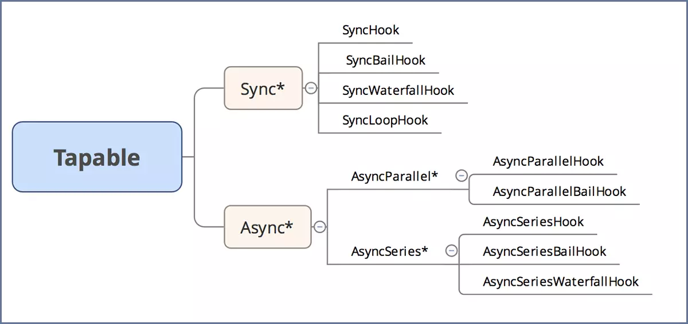

# Webpack 源码阅读总结

## 1 webpack是什么？

官方文档上是这样说的：[At its core, webpack is a static module bundler for modern JavaScript applications.](https://webpack.js.org/concepts/)

github上是这么说的：[webpack is a module bundler. Its main purpose is to bundle JavaScript files for usage in a browser, yet it is also capable of transforming, bundling, or packaging just about any resource or asset.](https://github.com/webpack/webpack)

实际上，webpack就是一个模块打包器(module bundler)，将多个模块打包成一个（或者多个）js文件。
模块可以是CommonJs、AMD、ES6模块，也可以是CSS、Images、JSON、LESS...又或者是自定义的模块。

## 2 为什么需要webpack？

现在的网站都向webapp进化，浏览器能做越来越多的事情，页面中有越来越多的js；
大量的代码需要被组织，即模块化；
网站的脚本数量太多会影响用户体验，通过代码打包可以提高性能；

## 3 webpack几个关键概念

### entry、output
entry和output很好理解，不作解析

### loader
loader就是模块转换器，使webpack能够去处理那些非JavaScript文件，即将文件转换为webpack能够处理的模块。

### plugin
插件接口功能极其强大,可以用来处理各种各样的任务。插件的范围包括，从打包优化和压缩，一直到重新定义环境中的变量。
除了可以通过plugins配置的插件，webpack内部也有很多插件（根据wepack配置调用各种插件参考 lib/WebpackOptionsApply.js）。

<b>webpack是一个基于事件流的插件合集。</b>
webpack的工作流程非常复杂，细分程度非常高，内部的钩子多达一百多个。
webpack内部各种各样的plugin至少有好几十个，而将这些插件控制在webapck事件流上的运行的就是webpack的Tapable，核心类Compiler和Compilation都继承Tapable。
Tapable作为webpack的核心库，用来处理各种同步异步串行并行的流程。参考第4点。

几个关键对象的相关钩子:
[compiler](https://www.webpackjs.com/api/compiler-hooks/)、
[compilation](https://www.webpackjs.com/api/compilation-hooks/)、
[parser](https://www.webpackjs.com/api/parser/)

webpack内部的钩子非常多，内部插件与钩子间的关系也非常复杂，
[可视化展示webpack内部插件与钩子关系](https://juejin.im/post/5bb06c55e51d450e7c0d8ab9)

## 4 Tapable

tapable与node的event类似，先注册（tap），然后在某个时刻触发/调用（call）
tapable暴露了很多Hook（钩子）类，为插件提供挂载的钩子。

在 tapable 源码中，触发事件的方法 call、callAsync、promise 都是通过 compile 方法生成的。
而在早期的版本，实现上简单很多，目前我还没看明白为什么做这些改动。

## 5 几个重要的类

### 1) Compiler
简单地理解，webpack就是一个Compiler！通过配置得到一个Compiler实例，调用run方法开始编译。包含了很多重要的钩子：entry-option, run, compile, make, after-compile, emit, after-emit。主要方法：run, watch, compile, emitAsset等等。

### 2) Compilation
该对象负责组织整个编译过程，包含了每个构建环节所对应的方法，如：addEntry, buildModule, processModuleDependencies, summarizeDependencies, createModuleAssets, createHash等等
### 3) chunk 
代码块,一个 Chunk 由多个模块组合而成。coding split的产物，我们可以对一些代码打包成一个单独的chunk，比如某些公共模块，去重，更好的利用缓存。或者按需加载某些功能模块，优化加载时间。在webpack3及以前我们都利用CommonsChunkPlugin将一些公共代码分割成一个chunk，实现单独加载。在webpack4 中CommonsChunkPlugin被废弃，使用SplitChunksPlugin

### 4) Module 
在 Webpack 里一切皆模块,一个模块对应着一个文件。子类：RawModule, NormalModule, MultiModule, ContextModule, DelegatedModule, DllModule, ExternalModule 等

### 5) Dependency
每一个依赖(Dependency)的实体都包含一个module字段，指向被依赖的Module. 这样通过Module的dependencies数组成员就能找出该模块所依赖的其它模块。
Dependency各种子类在lib/dependencies里

### 6) Template
Template是用来生成结果代码的。webpack中Template有四种：
MainTemplate.js 用于生成项目入口文件
ChunkTemplate.js 用于生成异步加载的js代码
ModuleTemplate.js 用于生成某个模块的代码
HotUpdateChunkTemplate.js

## 6 webpack流程

Webpack 的构建流程可以分为以下三大阶段：

1.初始化：启动构建，读取与合并配置参数，加载 Plugin，实例化 Compiler。 
2.编译：从 Entry 发出，针对每个 Module 串行调用对应的 Loader 去翻译文件内容，再找到该 Module 依赖的 Module，递归地进行编译处理。 
3.输出：对编译后的 Module 组合成 Chunk，把 Chunk 转换成文件，输出到文件系统。

以下表格为各个阶段关键的事件及描述：
<table>
<tr>
  <th>阶段</th>
  <th>事件</th>
  <th>描述</th>
</tr>
<tr>
  <td rowspan="4">初始化阶段</td>
  <td>初始化参数</td>
  <td>从配置文件和 Shell 语句中读取与合并参数</td>
</tr>
<tr>
  <td>加载插件</td>
  <td>依次调用插件的 apply 方法，让插件可以监听后续的所有事件节点。</td>
</tr>
<tr>
  <td>entry-option</td>
  <td>读取配置的 Entrys，为每个 Entry 实例化一个对应的 EntryPlugin</td>
</tr>
<tr>
  <td>after-resolvers</td>
  <td>根据配置初始化完 resolver，resolver 负责在文件系统中寻找指定路径的文件。</td>	
</tr>
<tr>
  <td rowspan="5">编译阶段</td>
  <td>run</td>
  <td>启动一次新的编译</td>
</tr>
<tr>
  <td>compile</td>
  <td>新的编译将要启动，同时会给插件带上 compiler 对象。</td>
</tr>
<tr>
  <td>compilation</td>
  <td>新的 Compilation 将被创建。一个 Compilation 对象包含了当前的模块资源、编译生成资源、变化的文件等</td>
</tr>
<tr>
  <td>make</td>
  <td>即将从 Entry 开始读取文件，根据文件类型和配置的 Loader 对文件进行编译，编译完后再找出该文件依赖的文件，递归的编译和解析</td>
</tr>
<tr>
  <td>after-compile</td>
  <td>一次 Compilation 执行完成</td>
</tr>
<tr>
  <td rowspan="4">输出阶段</td>
  <td>emit</td>
  <td>确定好要输出哪些文件后，执行文件输出，可以在这里获取和修改输出内容</td>
</tr>
<tr>
  <td>after-emit</td>
  <td>文件输出完毕。</td>
</tr>
<tr>
  <td>done</td>
  <td>成功完成一次完成的编译和输出流程</td>
</tr>
<tr>
  <td>failed</td>
  <td>如果在编译和输出流程中遇到异常导致 Webpack 退出时，就会直接跳转到本步骤</td>
</tr>
</table>

在编译阶段中，最重要的要数 compilation 事件了，因为在 compilation 阶段调用了 Loader 完成了每个模块的转换操作，在 compilation 阶段又包括很多小的事件
<table>
<tr>
  <th>事件</th>
  <th>事件</th>
  <th>描述</th>
</tr>
<tr>
  <td rowspan="4">complation</td>
  <td>build-module</td>
  <td>使用对应的 Loader 去转换一个模块。</td>
</tr>
<tr>
  <td>normal-module-loader</td>
  <td>在用 Loader 对一个模块转换完后，使用parser解析转换后的内容，输出对应的抽象语法树（AST），以方便 Webpack 后面对代码的分析。</td>
</tr>
<tr>
  <td>program</td>
  <td>从配置的入口模块开始，分析其 AST，当遇到 require 等导入其它模块语句时，便将其加入到依赖的模块列表，同时对新找出的依赖模块递归分析。</td>
</tr>
<tr>
  <td>seal</td>
  <td>所有模块及其依赖的模块都通过 Loader 转换完成后，根据依赖关系开始生成 Chunk。</td>
</tr>
<table>

淘宝团队分享的webpack流程图 
 

## 7 优化

文件搜索范围
### 1) exclude/include(module.rules.)
### 2) noParse(module.noParse)
### 3) resolve

精简第三方包
### 4) IgnorePlugin

压缩代码
### 5) UglifyJsPlugin

公共代码
### 6) SplitChunksPlugin/CommonsChunkPlugin

动态链接库
### 7) DllPlugin

按需加载
### 8) import(*)

删除无用代码
### 9) tree-shaking

多进程
### 10) happypack/thread-loader

输出分析
### 11) Webpack Analyse / webpack-bundle-analyzer

## 8 Q&A

### 1) 为什么看源代码时这么困难？
刚开始阅读源代码，代码跟着跟着就乱了，这也很正常。
本来webpack的流程就很复杂，因此，作者特意写了tapable这个库，来处理各种流程，整个webpack大大小小的钩子一百多个，想要完全弄清楚几乎不可能。
其实也没有必要,只要理解一些关键的钩子的顺序和关系，那么整个流程就比较容易理解了。

另外，回调函数本身就不太利于代码跟踪，项目里回调函数也非常多，跟踪起来更加困难，不过这个很难避免。
关于回调这个问题，自己在开发时可以用ES7的新特性async/await来代替。

### 2) tapable1.0版本的改动是为了什么？
为什么call方法要动态生成，我也是没想明白。
